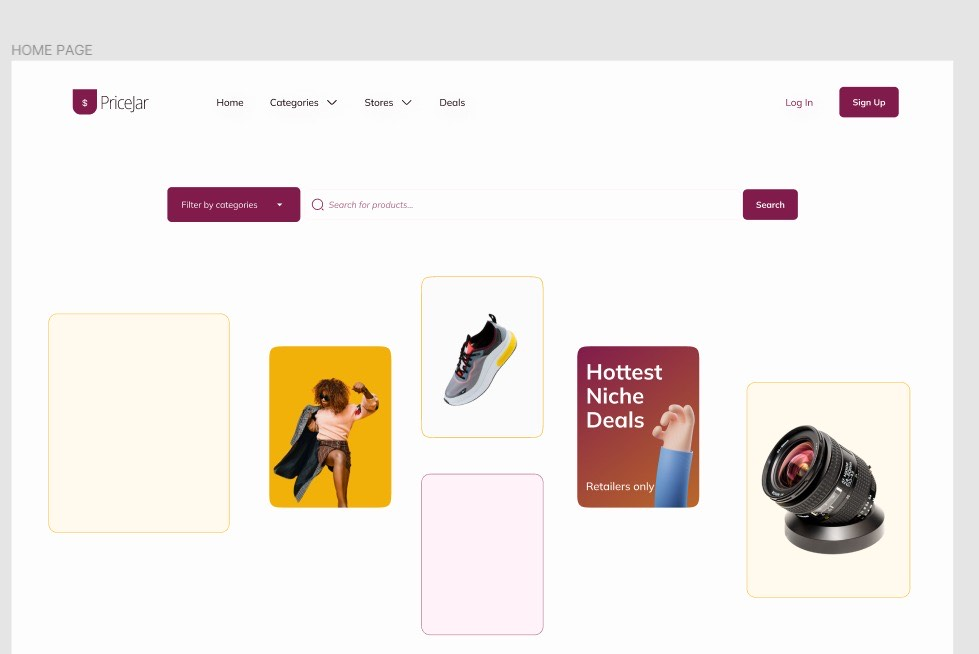

# PRICEJAR PROJECT

 ### [Full Documentation](https://docs.google.com/document/d/10J00hqO47xMX0zim5sT4b4InULSyD2A4T1RIMesly-A/edit)
  
 ### [Figma board](https://www.figma.com/file/hrjyHlK8Q1n2bBCBpCFDj1/Team30_PriceJar?node-id=28%3A2)
 
 ### [Github Project](https://github.com/orgs/zuri-training/projects/380)



# The User Guide

Pricejar is a website designed to help you make the best and cheapest choices in all of your online purchases, for more information on this check out our main page.

## Getting Started
  1. The first page is the About page, this page tells the user all they need to know about the site and helps them navigate how to get started.
  2. Now, there are two options a user can choose between:
      - **Authenticated User view**
      - **Unauthenticated User View**
  - ## Authenticated User View
    This implies that the user has an account with pricejar and gets some special privileges unauthenticated users can not get. In this context, you click on the Sign Up button to get yourself registered with pricejar, and in the future you can simply login to continue.
    
    The first thing the user sees when logged in is the home page where we have the search bar,
and below it we have a section of the page were the user can see the best deals that are
currently ongoing. Below the search bar is a categories section where the user can browse for his/her specific interest.

    Afterwards, we have a section for stores and their rating so the user can choose
where to shop and know which is more trustworthy.

    Finally, below all these is a section for top deals and trends so the user can get other
item suggestions that they might be interested in.

 - ## Unauthenticated User View 
     The user sees basically the same thing as the authenticated user but misses out on some extra suggestions and premium deals.

# The Developer Guide

This part of the documentation contains detailed instructions on the frameworks and software used in the overall build-up of our website. It focuses on the background information embedded in the different classes and templates used for breathing life into the website.

## Installations

- ### Python

The python version used for this website is **_3.10.4_**. [Python](www.python.org/downloads) contains the details about this version and a comprehensible tutorial on how to install python on your local machine.

- ### Django

Django is a python framework that excels in building the backend of websites. Django offers low-security risk and provides programmers with the ability to wire their web components together without having to bother about intricacies that may scare a programmer’s understanding and prolong project execution time.
The Django version used for this project is **_4.0.5_**.

To install Django on your local machine. Open your command prompt or terminal and type the following commands:

```
py -m pip install django~=4.0.5
```

The command above installs the specified version of Django for you.

- ### Bootstrap 
   The bootstrap version used for this website is 5.0 [bootstrap](www.getbootstrap.com/docs/5.0) contains the details about this version and a tutorial on how to install Bootstrap on your local machine.
   You can Discover what’s included in Bootstrap, including our precompiled and source code flavors on GitHub through this link [git-hub](https://github.com/twbs/bootstrap/blob/main/site/content/docs/5.2/getting-started/contents.md)
   
  Learn about the browsers and devices, from modern to old, that are supported by Bootstrap, including known quirks and bugs for each [here](https://github.com/twbs/bootstrap/blob/main/site/content/docs/5.2/getting-started/browsers-devices.md)
  
## The Build 
  Quick start!
You can get started by including Bootstrap’s production-ready CSS and JavaScript via CDN without the need for any build steps:

``` <!doctype html>
<html lang="en">
  <head>
    <meta charset="utf-8">
    <meta name="viewport" content="width=device-width, initial-scale=1">
    <title>Bootstrap demo</title>
    <link href="https://cdn.jsdelivr.net/npm/bootstrap@5.2.0/dist/css/bootstrap.min.css" rel="stylesheet" integrity="sha384-gH2yIJqKdNHPEq0n4Mqa/HGKIhSkIHeL5AyhkYV8i59U5AR6csBvApHHNl/vI1Bx" crossorigin="anonymous">
  </head>
  <body>
    <h1>Hello, world!</h1>
    <script src="https://cdn.jsdelivr.net/npm/bootstrap@5.2.0/dist/js/bootstrap.bundle.min.js" integrity="sha384-A3rJD856KowSb7dwlZdYEkO39Gagi7vIsF0jrRAoQmDKKtQBHUuLZ9AsSv4jD4Xa" crossorigin="anonymous"></script>
  </body>
</html>
```
  With this you are good to go for this project.
 ## Note:
- Bootstrap employs a handful of important global styles and settings, all of which are almost exclusively geared towards the normalization of cross browser styles.
- Bootstrap requires the use of the HTML5 doctype. Without it, you’ll see some funky and incomplete styling Bootstrap requires the use of the HTML5 doctype. Without it, you’ll see some funky and incomplete styling
- Bootstrap is developed mobile first, a strategy in which we optimize code for mobile devices first and then scale up components as necessary using CSS media queries. To ensure proper rendering and touch zooming for all devices, add the responsive viewport meta tag to your <head>
- For more straightforward sizing in CSS, we switch the global box-sizing value from content-box to border-box. This ensures padding does not affect the final computed width of an element, but it can cause problems with some third-party software like Google Maps and Google Custom Search Engine.

## Media Responsiveness:
 To ensure that this project can be viewed across all devices, kindly type this command in your html file:
  ```
<meta name="viewport" content="width=device-width, initial-scale=1">.
  ```
  You can find more about this from work from the listed above.

  - Click [here](https://docs.google.com/document/d/1KczsBHC9dQIAlNfpto56Uf0XgudUXTxa2gzi69Q7mgE/edit?usp=sharing) to access some pictures of the implementations described above.
  
## Unauthentication

This refers to the tools deployed in carving a customer who has not yet registered on our website. These tools are tailored to bequeath upon such users, the ability to signup, read what the website offers, have access to how the website works and even perform their intended searches. Below is an explicit explanation of how the tools are utilized in achieving this requirement

- ## LoginView

  The LoginView is goodness provided by the [**django.contrib.auth.views**](https://docs.djangoproject.com/en/4.0/topics/auth/default/#all-authentication-views) module. It basically helps us to render the login HTML template provided on our website. The LoginView when used inherits four template context variables :

  - **AuthenticationForm**: This provides the form for logging a user in.
  - **next**: This template provides the ***next*** destination after successful user login.
  - **site**: This is the model used for storing the domain and name attributes of the website. The site template helps us to fetch these attributesseamlessly.
  - **site_name**: This is an alias for ***site.name*** which helps us to store the details about our server name.

  > The sole reason for the selection of LoginView is the ability to switch between the default properties offered by the template to a user-defined property. This flexibility helps to disappoint limitations without compromising the intelligence of our website.

  The LoginView rendered the login template of this website which therefore translates to overriding the view’s default login provision. The following parameters were specified explicitly while harnessing the power of the LoginView class on our website.

  - **template_name:** This specifies the login template we displayed
  - **name**: This specifies the next destination after a successful login
  - **redirect_authenticated_user**: This helps in the decision-making of whether or not a user should be directed to another page after a successful login. It’s set to **true** on our website

- ## AboutView

  Being an unauthenticated user does not translate to the inability to have a grasp of what the website offers and the testimonies of users. This view entails a ***template_name*** which is a variable that specifies the HTML template to render on our webpage and also provides aid in the seamless interaction with our documentation.

- ## SignupView

  Fortunately, Django does not have a built-in class for signup. This view is responsible for the registration of the users of the services we render on our website. For a sophisticated operation such as this, one’s intuitions would have anticipated a default template, well probably Django developers figured that life shouldn’t be too easy. Our SignupView is consist of :

  - **CreateView**: The SignUpView inherits this view from the “django.views.generic” module. This CreateView helps us to create an instance of a table in a database.

  > Even when, Django developers decided to ration some of their templates, they could not go all hell out.

  - **model**: This specifies the fields we want to include in our database.
  - **template_name**: This refers to the customized HTML page we want to render.
  - **form_class**: This inherits the ***UserCreationForm*** class from [django.contrib.auth.forms](https://docs.djangoproject.com/en/4.0/topics/auth/default/#all-authentication-views) module. It helps to specify the model and the fields that will be filled by our users.
  - **success_url**: This dictates the next destination after successful signup.

- ## UnauthenticatedSearchView
  This is the core of the website. It takes input from users and supplies the input as an argument to an API. Afterwards, data fetched by our API is then cascaded inside the template which displays our HTML. Unauthenticated users will be able to browse through available products, however, the links attached to these products will not be active because the user is still unauthenticated.

## Authentication

This segment contains a breakdown of the implementations deployed to achieve user authentication. These implementations are :

- ## LoginView

  The LoginView is goodness provided by the [django.contrib.auth.views](https://docs.djangoproject.com/en/4.0/topics/auth/default/#all-authentication-views) module. It basically helps us to render the login HTML template provided on our website. The LoginView when used inherits four template context variables :

  - **AuthenticationForm**: This provides the form for logging a user in.
  - **next**: This template provides the “next” destination after successful user login.
  - **site**: This is the model used for storing the domain and name attributes of the website. The site template helps us to fetch these attributes seamlessly.
  - **site_name**: This is an alias for ***site.name*** which helps us to store the details about our server name.

  > The sole reason for the selection of LoginView is the ability to switch between the default properties offered by the template to a user-defined property. This flexibility helps to disappoint limitations without compromising the intelligence of our website.

  The LoginView rendered the login template of this website which therefore translates to overriding the view’s default login provision.
  The following parameters were specified explicitly while harnessing the power of the LoginView class on our website.

  - **template_name**: This specifies the login template we displayed
  - **name**: This specifies the next destination after a successful login
  - **redirect_authenticated_user**: This helps in the decision-making of whether or not a user should be directed to another page after a successful login. It’s set to “true” on our website

- ## LogOutView

  This is a Django built-in view which can be accessed from the module named [django.contrib.views](https://docs.djangoproject.com/en/4.0/topics/auth/default/#all-authentication-views). It contains the implementations of how a user logout is achieved. It contains the following attributes:

  - **next_page**: This specifies the URL to redirect the user to after logout. This process can be automated by specifying our LOGOUT_REDIRECT_URL variable to store the template we want to render after successful user logout.
  - **template_name**: This refers to the full name of a template to display after logging out the user.
  - **redirect_field_name**: This defaults to ‘next’ if not specified. However, this can be overridden by specifying the URL to redirect to by using a GET field.
  - **Template context**: This refers to elements like title, site and site_name which are used to hold the string label for our logout page, the site name and domain from our HttpRequest and our server information respectively.
  - **logout_then_login(request,login_url=None)**: This provides a concise method of logging out a user and redirecting a user to the login page.

- ## Password

  - ## PasswordResetView

    To allay the fears which emanate from users losing their password, the website features a PasswordResetView which was implemented using Django's built-in PasswordResetView which can be accessed from django.contrib.auth.views module. This allows the user to reset their password by generating a one-time link that can be used to reset the password and sending that link to the user’s registered email address. Certain criteria must be met before the password reset mail can be sent successfully:

            1.The email address provided must exist in the system
            2.The requested user must be active
            3.The requested user has a usable password which means the user is registered in our database.

    The PasswordResetView has the following attributes:

    - **template_name**: This contains the full name of a templated used for the password reset form.
    - **form_class**: This contains the form that will be used to get the email of the user to reset the password.
    - **email_template_name**: This refers to a template which is used for generating the email with the password reset link.
    - **token_generator**: This refers to the instance of the class used to check the one-time link sent to the user’s email.
    - **Template Context**: This consists of :
      - **Form**: The form for resetting the user’s password which can be specified using the variable “form_class”
      - **User**: This refers to the current “User” according to the email form field.
      - **site_name**: This is an alias for site.name which helps us to store the details about our server name.
      - **protocol**: This specifies whether we are using HTTP or HTTPS.
      - **UID**: This is the user’s primary key
      - **Token**: This helps to check that the reset link is valid

  - ## PasswordResetDoneView

    This handles the page displayed after a successful password reset. All that is needed to be supplied to it is the template_name which stores the HTML template to be displayed on successful implementation of resetting our password.

  - ## PasswordResetConfirmView

    After the request to reset the password had been made by the user, on clicking the unique link sent to the user’s email, the user has to be redirected to a page which presents a form for entering a new password. PasswordResetConfirmView takes care of the aforementioned requirement. It consists of the following attributes :

     - **template_name**: This refers to the full name of a template to display the password to confirm the view.
     - **form_class**: This refers to the form that will be used to set the password.
     - **success_url**: This refers to the page to redirect to after a successful password reset.

  - ## PasswordResetCompleteView

    This provides the user with an affirmation that their password has been successfully reset. A template_name is given to display the view to render after a successful password reset.

  - ## PasswordChangeView

    Peradventure a user wants to change their password for any reason, the PasswordChangeview is also a Django built-in class which is stored in the [django.contrib.auth.views](https://docs.djangoproject.com/en/4.0/topics/auth/default/#all-authentication-views) module. The following attributes of the class were used for this website:

    - **template_name**: This contains the full name of the template used in displaying the password change form.
    - **success_url**: This refers to the URL to redirect to after a successful password change.
    - **form_class**: This is a custom “change password” form which must accept our user keyword argument. Factually, this form is the mechanism behind the actual password change.

  - ## PasswordChangeDoneView
    This view takes care of the page shown after a successful password change by the user. It contains only one attribute which is template_name. The template_name specifies the full name of a template to use for displaying a successful password change.

- ## CommentView

  In order to receive feedbacks from our users, a comment view is provided. This comment view gives users the volition to do three major things: edit their comments, delete their comments and also update their comments. These privileges are made possible because the CommentView inherits Django's CreateView, DeleteView and UpdateView from the “django.contrib.views” module. The CommentView has three attributes:

  - **model**: This refers to the structure of our database. That is, the fields to be populated in the database when the users submit their comments.
  - **template_name**: This refers to the name of the template used to display the comment section.
  - **success_url**: This provides the URL to redirect to after a successful submission, editing or deletion of the user’s comment.

- ## AuthenticatedSearchView

  This view has the capabilities to search for products across e-commerce websites and accompany the products with links to these products. It consists of the template_name attribute which is the name of the template embodying the products to be displayed and their respective links.
  
  
